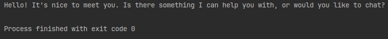

# llumpy

> Provider-agnostic client wrapper for prompting LLMs

## 🤖 Supported Providers

- [Anthropic](TODO)
- [OpenAI](TODO)
- [Ollama](TODO)

## ✨ Features

- [One](TODO) or [Few](TODO) Shot Prompting
- [Load Prompts From File](TODO)
- [Streaming LLM Responses](TODO)
- [Asynchronous Variants](TODO)
- [Automatic Retry Handlers](TODO)
- [Custom Provider Clients](TODO)

## Installation

```bash
pip install git+https://github.com/dlg1206/llumpy.git
```

or add to `requirements.txt`

```txt
llumpy @ git+https://github.com/dlg1206/llumpy.git
```

## Quickstart

1. Create a client

```python
from llumpy.providers import AnthropicClient, OpenAIClient, OllamaClient

# API key env var: OPENAI_API_KEY
gpt = OpenAIClient('gpt-5.4')

# API key env var: ANTHROPIC_API_KEY
claude = AnthropicClient('claude-sonnet-4-6')

# Ollama server url env var: OLLAMA_SERVER_URL (Default: http://localhost:11434)
llama3_latest = OllamaClient('llama3')  # default ':latest'
llama3_8b = OllamaClient('llama3', '8b')
```

> [!WARNING]
> Clients will fail to be initialized if API keys are bad, models do not exist, or key
> does not have access to that model.

2. Prompt

```python
from llumpy.providers import OllamaClient

llama3_8b = OllamaClient('llama3', '8b')
response = llama3_8b.prompt_one("Hello!")
print(response)
```



See [documentation](TODO) for additional usage.