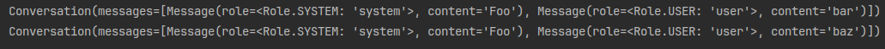
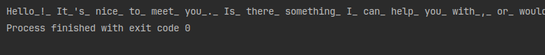
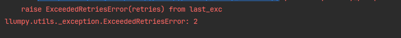
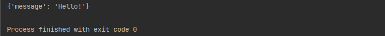
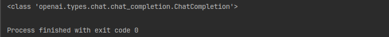

# llumpy

> Client wrapper library for OpenAI, Anthropic, and Ollama APIs

> [!WARNING]
> OpenAI and Anthropic clients have not been thoroughly tested due to lack of API keys.

- [Installation](#installation)
- [Basic Usage](#basic-usage)
- [Advanced Usage](#advanced-usage)
- [Custom Clients and Handlers](#custom-clients-and-handlers)

## Installation

```bash
pip install git+https://github.com/dlg1206/llumpy.git
```

or add to `requirements.txt`

```txt
llumpy @ git+https://github.com/dlg1206/llumpy.git
```

## Basic Usage

### Creating Clients

```python
from llumpy.providers import AnthropicClient, OpenAIClient, OllamaClient

# API key env var: OPENAI_API_KEY
gpt = OpenAIClient('gpt-5.4')

# API key env var: ANTHROPIC_API_KEY
claude = AnthropicClient('claude-sonnet-4-6')

# Ollama server url env var: OLLAMA_SERVER_URL (Default: http://localhost:11434)
llama3_latest = OllamaClient('llama3')  # default ':latest'
llama3_8b = OllamaClient('llama3', '8b')
```

> [!WARNING]
> Clients will fail to be initialized if API keys are bad, models do not exist, or key
> does not have access to that model.

### Prompting Models

#### Prompt One

> One-shot prompt to an LLM. Useful for simple, one off prompts

```python
from llumpy.providers import OllamaClient

llama3_8b = OllamaClient('llama3', '8b')
response = llama3_8b.prompt_one("Hello!")
print(response)
```


#### Prompt Many

> Few-shot prompt to an LLM. Useful for advanced, chain-of-thought prompting

```python3
import textwrap

from llumpy.providers import OllamaClient

llama3_8b = OllamaClient('llama3', '8b')
response = (llama3_8b.system(
    "You are a pirate. You must speak as a pirate at all times, using phrases like 'Arrr', 'matey', and 'shiver me timbers'.")
            .user("What is the weather like today?")
            .assistant(
    "Arrr matey! The skies be grey as Davy Jones' locker and the winds be howlin' somethin' fierce! Shiver me timbers, tis a fine day fer sailin'!")
            .user("What should I wear?")
            .prompt())

print(textwrap.fill(response, width=100))
```


Using prompts directly are for single use only. For reusable conversations, the `ConversationBuilder` can be used and
ensures the resulting conversions is in a valid order to send to the LLM. The resulting conversation can be used with
the client's `prompt_many()` method.

```python
import textwrap

from llumpy.core import ConversationBuilder
from llumpy.providers import OllamaClient

llama3_8b = OllamaClient('llama3', '8b')
conversation = (
    ConversationBuilder()
    .system(
        "You are a pirate. You must speak as a pirate at all times, using phrases like 'Arrr', 'matey', and 'shiver me timbers'.")
    .user("What is the weather like today?")
    .assistant(
        "Arrr matey! The skies be grey as Davy Jones' locker and the winds be howlin' somethin' fierce! Shiver me timbers, tis a fine day fer sailin'!")
    .user("What should I wear?")
    .build()
)
response = llama3_8b.prompt_many(conversation)
print(textwrap.fill(response, width=100))
```

Using the `file` param allows to read prompts directly from files like so:

```python
from llumpy.core import ConversationBuilder

conversation = ConversationBuilder().user(file="prompts/user.prompt").build()
```

Single use conversations also support the `file` param.

The builder also supports ephemeral messages, allowing for a root conversation to be reused with only the final prompt
swapped out like so:

```python
from llumpy.core import ConversationBuilder

builder = ConversationBuilder().system("Foo")
for tail in ['bar', 'baz']:
    print(builder.build_with_user(tail))
```



`build_with_user()` and `build_with_assistant()` also support the `file` arg as well. Single use conversations do **NOT**
support ephemeral messages

#### Streaming Response

> Stream token responses from LLM instead of waiting for complete response

```python
from llumpy.core import ConversationBuilder
from llumpy.providers import OllamaClient

llama3_8b = OllamaClient('llama3', '8b')
conversation = ConversationBuilder().user("Hello!").build()

for chunk in llama3_8b.prompt_stream(conversation):
    print(llama3_8b.extract_text(chunk), end="_", flush=True)
```



#### Additional LLM Params

> For other LLM params, they can be provided as additional params in the prompt method

```python
from llumpy.core import ConversationBuilder
from llumpy.providers import OllamaClient

llama3_8b = OllamaClient('llama3', '8b')
conversation = (ConversationBuilder()
                .system("You are an color expert. Return a single line of text without extra explanation")
                .user("Create a name for a shade of red")
                .build())
print(llama3_8b.prompt_many(conversation, temperature=0.0))
print("---")
print(llama3_8b.prompt_many(conversation, temperature=1.0))
```


## Advanced Usage

### Async Methods

> Async versions are available for OpenAI, Anthropic, and Ollama clients and their corresponding methods

```python
import asyncio

from llumpy.providers import AsyncOllamaClient


async def main():
    llama3_8b = AsyncOllamaClient('llama3', '8b')
    response = await llama3_8b.prompt_one("Hello!")
    print(response)


if __name__ == '__main__':
    asyncio.run(main())
```


```python
import asyncio

from llumpy.core import ConversationBuilder
from llumpy.providers import AsyncOllamaClient


async def main():
    llama3_8b = AsyncOllamaClient('llama3', '8b')
    conversation = ConversationBuilder().user("Hello!").build()

    async for chunk in await llama3_8b.prompt_stream(conversation):
        print(llama3_8b.extract_text(chunk), end="_", flush=True)


if __name__ == '__main__':
    asyncio.run(main())
```

### Retry Handlers

> Retry handlers validate the LLM response and automatically reprompts if fails

```python
from llumpy.providers import OllamaClient
from llumpy.retry import JSONRetryHandler

llama3_8b = OllamaClient('llama3', '8b')

print(llama3_8b.prompt_one("Hello!", handler=JSONRetryHandler(), retries=2))
```



```python
from llumpy.providers import OllamaClient
from llumpy.retry import JSONRetryHandler

llama3_8b = OllamaClient('llama3', '8b')

print(llama3_8b.system("Only reply in JSON").user("Hello!").prompt(handler=JSONRetryHandler()))
```



Currently, `JSONRetryHandler` is the only handler that parses the LLM response into a JSON object.
See [Custom Handlers](#custom-handlers) for custom handlers.

### Vendor-Specific Responses

> To access vendor specific LLM responses, use the `vendor_prompt()` or `vender_prompt_stream()` methods

```python
from llumpy.providers import OllamaClient
from llumpy.retry import JSONRetryHandler
from llumpy.core import ConversationBuilder

llama3_8b = OllamaClient('llama3', '8b')

conversation = ConversationBuilder().user("Hello!").build()
response = llama3_8b.vendor_prompt(conversation)

# ollama uses OpenAI APIs
print(type(response))
```



## Custom Clients and Handlers

### Custom Clients

> Inherit the `ModelClient` or `AsyncModelClient` classes and methods

```python
from typing import Any

from llumpy.core import ModelClient, Conversation, AsyncModelClient


class MyLLMClient(ModelClient):
    def vendor_prompt(self, conversation: Conversation, **prompt_kwargs: Any) -> Any:
        """Raw API call, returns vendor-specific response object"""
        pass

    def vendor_prompt_stream(self, conversation: Conversation, **prompt_kwargs: Any) -> Any:
        """Raw API call, returns vendor-specific response stream object"""
        pass

    def extract_text(self, response: Any) -> str | None:
        """Extract text from vendor-specific response object"""
        pass

    def validate(self) -> None:
        """Validate the client is ready to use"""
        pass


class MyAsyncLLMClient(AsyncModelClient):
    async def vendor_prompt(self, conversation: Conversation, **prompt_kwargs: Any) -> Any:
        """Raw API call, returns vendor-specific response object"""
        pass

    async def vendor_prompt_stream(self, conversation: Conversation, **prompt_kwargs: Any) -> Any:
        """Raw API call, returns vendor-specific response stream object"""
        pass

    def extract_text(self, response: Any) -> str | None:
        """Extract text from vendor-specific response object"""
        pass

    async def validate(self) -> None:
        """Validate the client is ready to use"""
        pass
```

### Custom Handlers

> Inherit the `RetryHandler` or `AsyncRetryHandler` classes and methods

```python
from typing import Any, Tuple, Type

from llumpy.retry import RetryHandler, AsyncRetryHandler


class MyRetryHandler(RetryHandler):
    def _format(self, response: str) -> Any:
        """Attempt to format the response to validate it and raise an exception"""
        pass

    @property
    def _retry_on(self) -> Tuple[Type[Exception], ...]:
        """(Optional) Return the tuple of exceptions thrown by _format"""
        pass


class MyAsyncRetryHandler(AsyncRetryHandler):
    def _format(self, response: str) -> Any:
        """Attempt to format the response to validate it and raise an exception"""
        pass

    @property
    def _retry_on(self) -> Tuple[Type[Exception], ...]:
        """(Optional) Return the tuple of exceptions thrown by _format"""
        pass
```